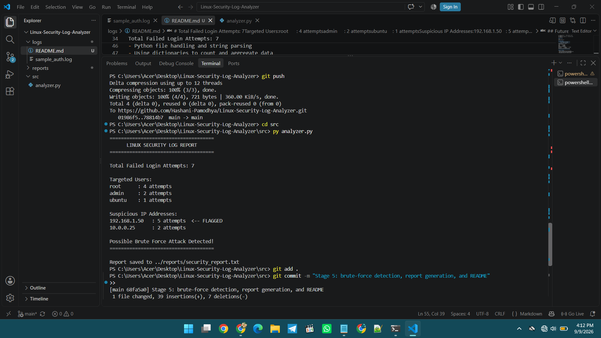
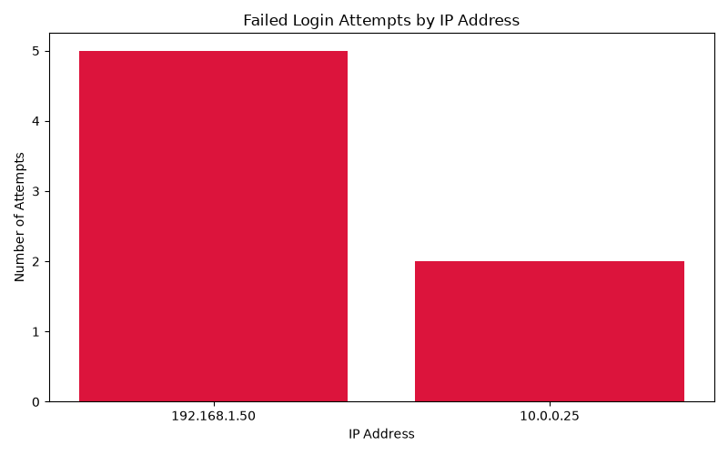

# 🛡️ Linux Security Log Analyzer

A Python tool that parses Linux SSH authentication logs to detect failed login attempts, identify targeted usernames, flag suspicious repeated IP addresses, and highlight possible brute-force attacks. Generates a clean, readable security summary report.

## Attack Visualization

## Features
- Parses Linux `auth.log` style SSH entries
- Counts total failed login attempts
- Tracks which usernames are targeted most
- Tracks which IP addresses are responsible for attempts
- Flags IP addresses exceeding a brute-force threshold
- Saves a formatted report to `reports/security_report.txt`
- Uses regex for robust log parsing
- Interactive brute-force threshold input
- Graceful handling of missing log files
- Generates a bar chart visualizing top attacking IPs

## Tech Stack
- Python 3
- Git & GitHub for version control

## Project Structure
Linux-Security-Log-Analyzer/
├── logs/              # Sample Linux auth log
├── src/
│   └── analyzer.py    # Main analysis script
├── reports/
│   └── security_report.txt  # Generated report
└── README.md

## How to Run
cd src
python analyzer.py

## Sample Output
=====================================
      LINUX SECURITY LOG REPORT
=====================================
Total Failed Login Attempts: 7
Targeted Users:
root      : 4 attempts
admin     : 2 attempts
ubuntu    : 1 attempts
Suspicious IP Addresses:
192.168.1.50   : 5 attempts  <-- FLAGGED
10.0.0.25      : 2 attempts
Possible Brute Force Attack Detected!
=====================================

## What I Learned
- Python file handling and string parsing
- Using dictionaries to count and aggregate data
- Basic brute-force attack detection logic
- Git/GitHub workflow for version control

## Future Improvements
- Use regex for more robust log parsing
- Export report as CSV/JSON
- Add command-line arguments for custom thresholds
- Visualize attack sources with charts